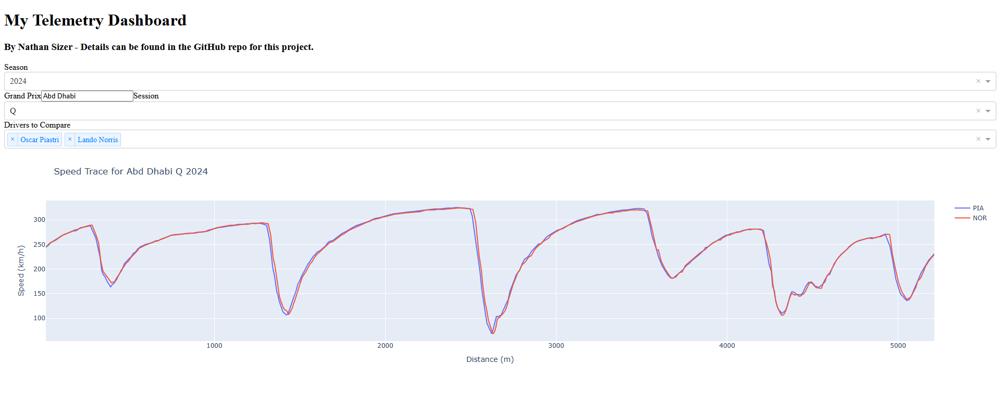
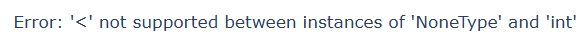

# F1 Telemetry Dashboard

An interactive dashboard built with Python, using Dash and the FastF1 API to compare Formula 1 telemetry data between drivers.

## Author:
Nathan Sizer – [LinkedIn](https://www.linkedin.com/in/nathan-sizer)

## Features:
- Select year, race weekend, and session
- Compare speed traces of drivers' fastest laps in the selected session.

## Screenshots:
\

##Notes:
- If you get the below error message, your tab will probably say "Updating..." - just give it a minute and the page should then load :)\

### TODO:
- Add screenshots above
- Include more than the current 3 drivers
- Maybe something which tracks laps through a race, tyre strategy etc.
- Maybe host somewhere?

